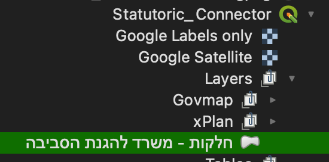

# Common_Connectors

Connector files are perfectly normal QGiS project files, used for giving easier and faster acceses to publicly available GiS data. This is done easily by organizing and grouping connections from different sources in one place depending on their topics. Finding data becomes a lot easier and dragging layers from the file the Connector file into new projects will set them with a pre-made default style and settings. Basicly dragging is all you need to do and you're ready to work.
**QGiS 3.40 is needed since a lot of layers use proxy prefix 

## Longer Description
Sorting through publicly available data has become the new information barrier for most. Keeping up with all links to relevant data, indexing and finding data became an extra expertise for us GiS specialists.
These Common_Connector files are made as an advanced, fast and completly intuative organizing tool. So intuative actually, it's also a great way to share these layer connections with clients or peers also using QGiS. Because layers load with a previously defined default style, the Connector file is also a great way to save and share your costum style settings (including filters, actions and embedded scripts) prepared for these layers. 

Potentially, on addition for being a great organizing tool, these Connector files are a suggestion for a new type of media - aimed at republishing new ways to connect and use already openly available data for the QGiS community. This repo aims at showcasing this potenial.

### ** The Connector files shared here are used to group together selected layers by varying topics, all concerning the Israeli GiS community at large. 
- **il_Statutoric-Connector** - Groups israeli statutoric data published on various government official servers. Some layers include costum-made styles with embbeded filters, actions and better readablity at large.

A short intro for this file can be found on [QGiS Israel](https://www.youtube.com/live/o87pR5tZ_DU) - beginning after 35 minutes.

- **il_Historic-Connector** - Groups israeli historic data from various source grouped by geographical areas. Work on this file is still at progress but most layers and features are there to use

You are more then welcome to upload files of you own here. 

### Fetching a layer from file:
Looking up and adding a layer from the Connector file is made easy with "Embedded layer and groups" or better - **using the browser panel to show the project's already organized layers tree**.
Using your **browser panel** browse to the where you saved you file. Then click on the triangle on the right and browse through the Connector file's layers. That's it

</img>

## Contact me 
At Erez.Sg@gmail.com
And if you liked this, check out [Common_StartingPoint](https://github.com/ErezSarig/Common_startingPoint) as well
